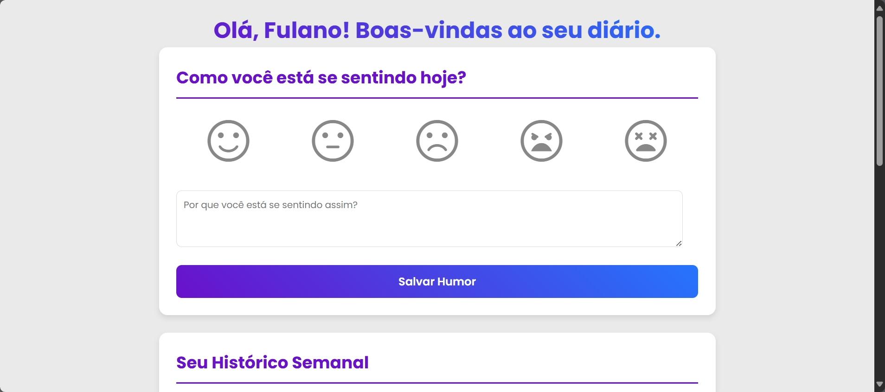

# Diário de Humor

Este é um aplicativo web interativo criado para ajudar os usuários a registrar e monitorar seu humor diário. A aplicação possui uma interface intuitiva e direta que salva os dados diretamente no navegador do usuário para uma experiência contínua.

## 🎨 Interface Visual

A aplicação recebe o usuário com uma tela de boas-vindas para personalização. A tela principal é organizada em seções claras, com um seletor de humores que utiliza ícones grandes e interativos, uma área para anotações e painéis que exibem o histórico e um resumo visual dos humores registrados. O design é focado na usabilidade, com um tema de cores agradável em tons de roxo e azul.

## ✨ Funcionalidades Principais

* **Boas-vindas Personalizada:** Inicia com um modal que solicita o nome do usuário para criar uma saudação personalizada.
* **Registro de Humor Interativo:** Permite a seleção de um entre cinco humores (Feliz, Normal, Triste, Irritado, Cansado) com feedback visual imediato.
* **Anotações Pessoais:** Oferece um campo de texto para que o usuário possa descrever o motivo do seu sentimento.
* **Persistência de Dados:** Utiliza o `localStorage` do navegador para salvar todas as entradas, garantindo que os dados não sejam perdidos ao fechar a página.
* **Histórico Semanal:** Exibe uma lista com as sete entradas mais recentes, incluindo data, humor e a descrição associada.
* **Resumo de Emoções:** Apresenta um resumo quantitativo, mostrando quantas vezes cada humor foi registrado.

## 🚀 Tecnologias Utilizadas

* **HTML5:** Para a estrutura semântica do conteúdo.
* **CSS3:** Para a estilização completa, utilizando Flexbox, Variáveis CSS, gradientes e transições para uma interface fluida.
* **JavaScript (ES6+):** Para toda a lógica da aplicação, manipulação do DOM e gerenciamento de eventos e dados.
* **Google Fonts & Icons:** A fonte "Poppins" e os ícones "Material Symbols Rounded" foram utilizados para garantir um visual consistente e moderno.

## ✅ Checklist de Requisitos do Projeto

O projeto foi desenvolvido atendendo a todos os requisitos iniciais propostos:

| Requisito                                                    | Status      | Implementação                                                                                                                                                                   |
| ------------------------------------------------------------ | ----------- | ------------------------------------------------------------------------------------------------------------------------------------------------------------------------------- |
| **Painel de seleção de emoji e campo de texto** | ✅ | A seção `mood-tracker` no `index.html` contém um seletor de ícones (`.emoji-selector`) e uma área de texto (`textarea`).                                                           |
| **Registrar entrada ao clicar em "Salvar"** | ✅ | O `script.js` possui um listener no botão `#save-button` que chama a função `saveMoodEntry` para criar e armazenar o novo registro de humor.                                         |
| **Exibir histórico semanal e frases** | ✅ | A função `displayWeeklyHistory` renderiza os 7 registros mais recentes, exibindo o ícone, a data, o nome do humor e a frase digitada.                                               |
| **Mostrar resumo do humor (contagem)** | ✅ | A função `displayMoodSummary` calcula a frequência de cada humor e exibe a contagem total na interface.                                                                         |
| **(Opcional) Salvar dados no `LocalStorage`** | ✅ | Os dados são salvos com `localStorage.setItem()` e recuperados com `localStorage.getItem()`, garantindo a persistência entre as sessões.                                          |
| **Utilizar pelo menos dois eventos do DOM** | ✅ | Foram utilizados os eventos **`click`** (nos botões e ícones) e **`keyup`** (no campo de nome para permitir o início com a tecla "Enter").                                           |
| **Interface agradável com CSS** | ✅ | O arquivo `style.css` foi elaborado com um tema de cores coeso, variáveis, gradientes, sombras e transições para uma experiência de usuário profissional.                          |
| **Código organizado com funções** | ✅ | O `script.js` está bem estruturado, com funções de responsabilidade única como `startApp`, `saveMoodEntry`, `updateDisplay`, etc., o que facilita a leitura e a manutenção.         |
| **Requisito Adicional: Pedir nome do usuário** | ✅ | A aplicação inicia com um modal (`#welcome-modal`) que solicita o nome do usuário. Esse nome é então usado para criar uma mensagem de boas-vindas personalizada na tela principal. |

---

## ▶️ Como Executar o Projeto

1.  Clone ou faça o download deste repositório.
2.  Navegue até a pasta raiz do projeto.
3.  Abra o arquivo `index.html` diretamente em um navegador web moderno (como Google Chrome, Mozilla Firefox ou Microsoft Edge).

